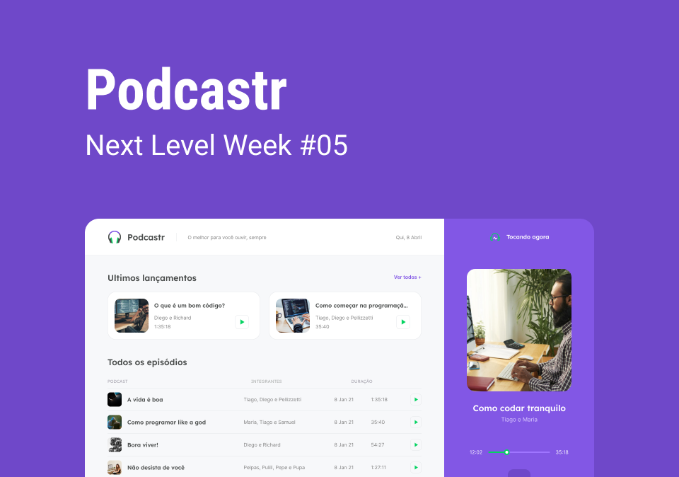
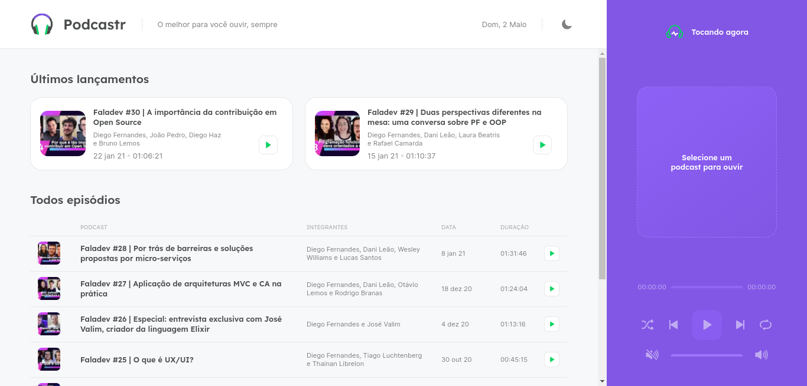
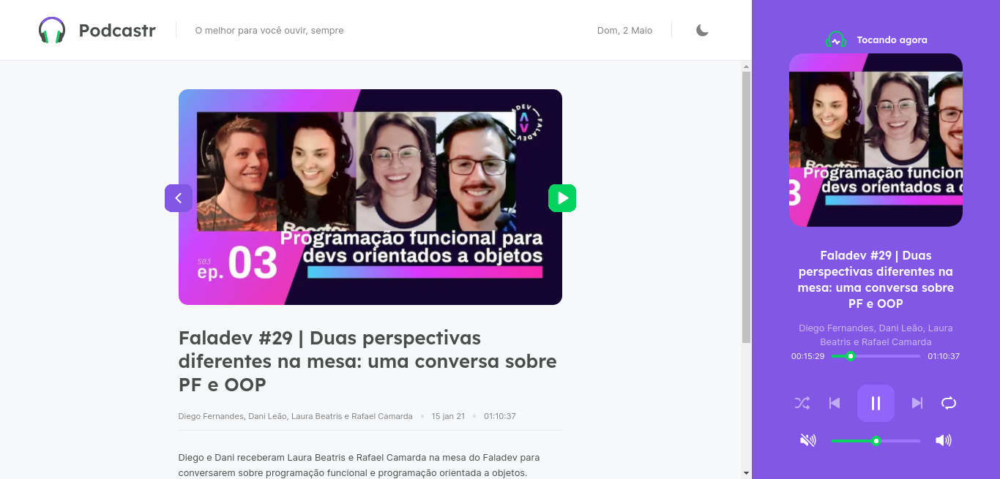
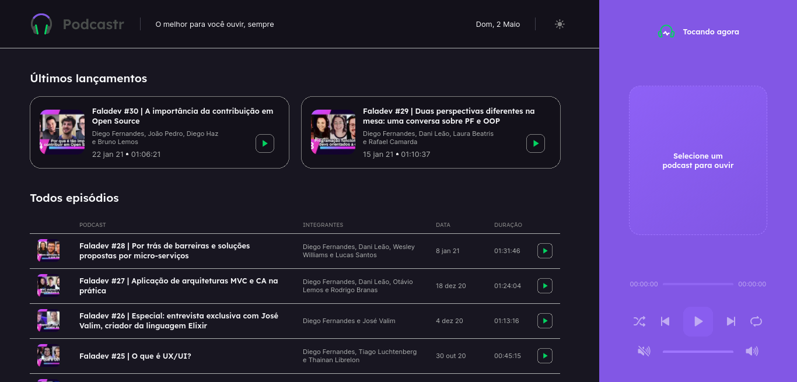
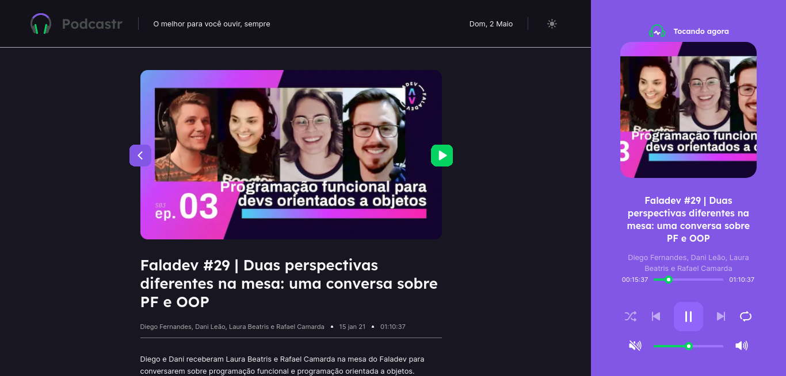
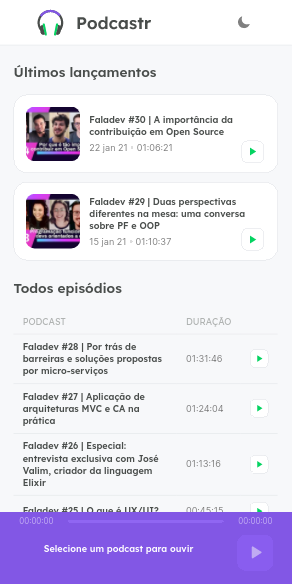
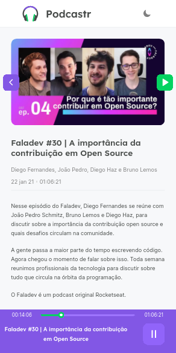
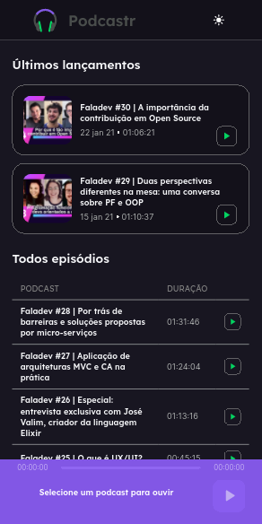
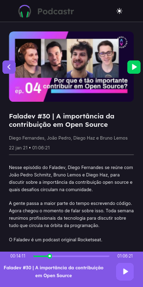

<p align="center">
  
</p>


<p align="center">
  <a href="#-sobre">Sobre</a>&nbsp;&nbsp;&nbsp;|&nbsp;&nbsp;&nbsp;
  <a href="#-layout">Layout</a>&nbsp;&nbsp;&nbsp;|&nbsp;&nbsp;&nbsp;
  <a href="#-tecnologias">Tecnologias</a>&nbsp;&nbsp;&nbsp;|&nbsp;&nbsp;&nbsp;
  <a href="#-projeto">Projeto</a>&nbsp;&nbsp;&nbsp;|&nbsp;&nbsp;&nbsp;
  <a href="#-como-executar">Como executar</a>
</p> 

</br>

<p align="center">
  
</p>


</br>

## 📖 Sobre
O Podcastr é um app para podcast desenvolvido durante a NLW#5 da Rocketseat Trilha ReactJs entre os dias 19 e 25 de Abril 2021. 

</br>

## 🖼 Layout

<p align="center" >
   
   
   
   
   
</p>

<p align="center" >
   
   
   
   
   
</p>
   
</br>

## ⚙ Tecnologias

Esse projeto foi desenvolvido com as seguintes tecnologias:

- [ReactJS](https://www.reactjs.org)
- [NextJS](https://nextjs.org)
- [TypeScript](https://www.typescriptlang.org)
- [Sass](https://sass-lang.com)
- [JSONServer](https://github.com/typicode/json-server)

</br>

## 💻 Projeto
O Podcastr é uma app para ouvir podcasts no navegador. 

</br>

## 🚀 Como executar

- Clone o repositório
```
git clone https://github.com/BrunoBecoski/NLW-5-Podcastr-ReactJS.git
```
- Instale as dependências
```
yarn install
```
- Inicie o servidor JSON
``` 
yarn server 
```
- Inicie o servidor Next.js
``` 
yarn dev
```
- Acesse no seu navegador
```
http://localhost:3000
```
